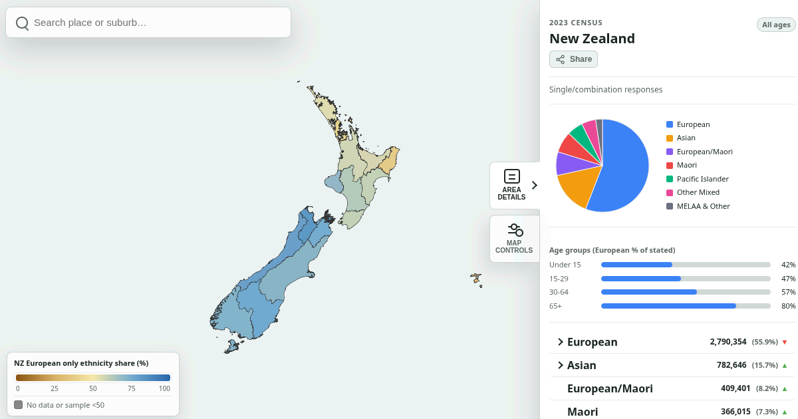

# NZ Demographics Map

Interactive map of New Zealand census ethnicity data (2013, 2018, 2023) by regional council, territorial authority, and statistical area (SA2).

Built by [Right Minds NZ](https://rightminds.nz). Data from [Stats NZ](https://www.stats.govt.nz/).



## Features

- Zoom from regions → districts → neighbourhoods (SA2)
- Age-group filter and year comparison (vs 2013)
- Expandable ethnicity breakdowns (level 3 groups)
- Place search (type a suburb or district)
- Progressive loading — only a few MB for typical browsing

## Live site

GitHub Pages: **https://dieuwedeboer.github.io/nz-demographic-map/**

## Stack

- React 19 + TypeScript + Vite
- MapLibre GL + PMTiles (static vector tiles)
- Biome, Vitest, Knip

No backend. Fully static; safe to host on GitHub Pages, Cloudflare Pages, Netlify, or S3.

## Local development

```bash
npm install
npm run dev
```

```bash
npm test
npm run lint
npm run build
```

Prepared data and tiles under `public/` are committed so the app runs without a Stats NZ API key.

## Redeploying data (maintainers)

Raw census dumps and source geometry are gitignored. To refresh:

1. Copy `.env.example` → `.env` and set `STATSNZ_API_KEY` (never commit `.env`)
2. `npm run data:fetch-all` and `npm run data:fetch-level3`
3. Ensure GeoJSON exists under `src/assets/` (local only)
4. `npm run data:prepare`
5. Rebuild PMTiles if boundaries changed, then commit `public/data/prepared/` and `public/tiles/`

## Data sources

- Census ethnicity (single/combination and level 3 total responses): Stats NZ Data Explorer (`CEN23_ECI_008`, `CEN23_ECI_016`)
- Boundaries: Stats NZ 2025 clipped regional council, territorial authority, and SA2 (via [datafinder.stats.govt.nz](https://datafinder.stats.govt.nz/))

Map colouring shows European-only share of total stated ethnicity for the selected year and age group.

## Licence

Application code: use freely with attribution to Right Minds NZ.

Stats NZ data is subject to [Stats NZ copyright and Creative Commons attribution](https://www.stats.govt.nz/about-us/copyright-and-terms-of-use/). Basemap tiles © OpenStreetMap contributors.
